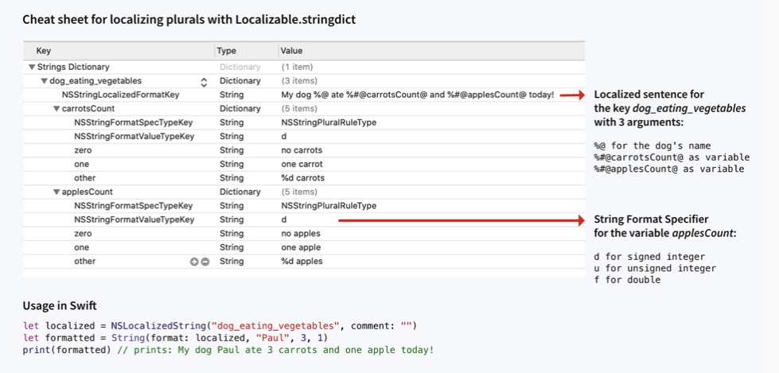

# Example_Localization
Example iOS application in Swift to demonstrate how to properly use `Strings` and `StringsDict` files to achieve localization.

## Basic Localization
Localizing strings is fairly straightforward. `Strings` files are used for this. Each localized string in a `Strings` file is represented by a key-value pair. Each locale supported in the application has it's own `Strings` file.
The key of the key-value pair is consistent across locales and `Strings` files.
The value of the key-value pair is the actual "display" value which is localized in the locale of the `String` file.
At run time, the locale or language of the device dictates which `Strings` file is used when an `NSLocalizedString` with a provided key is intialized.

`Strings` files support parameterization via [String Format Specifiers](https://developer.apple.com/library/archive/documentation/Cocoa/Conceptual/Strings/Articles/formatSpecifiers.html).

### Examples

Acceptable values in `Strings` files include:
- "OK"
- "Hello World!"
- "Hello %@" where "%@" is a name.

Unacceptable values in `Strings` files include:
- "Found %d matches in your area!"
- "Found %d match in your area!"

You should **NOT** use `Strings` files for translations that have pluralization. You'll use `StringsDict` for these cases.

## Pluralized Localization
Localizing strings with pluralization is a little more complex. `StringsDict` files are used for this. Similar to `Strings` files, each locale or language the application supports should have its own `StringsDict` file. Again, at run time, the locale or language of the device dictates which `StringsDict` file is used when an `NSLocalizedString` with a provided key is intialized.
In general, you should follow this cheat-sheet for the basic setup of a `StringsDict` file.

### Helpful links:
- https://developer.apple.com/documentation/xcode/localizing-strings-that-contain-plurals

# Screenshots

## English

| English Example 1 | English Example 2 | English Example 3 |
| --- | --- | --- |
|  |  |  |

## Spanish
| Spanish Example 1 | Spanish Example 2 | Spanish Example 3 |
| --- | --- | --- |
|  |  |  |
